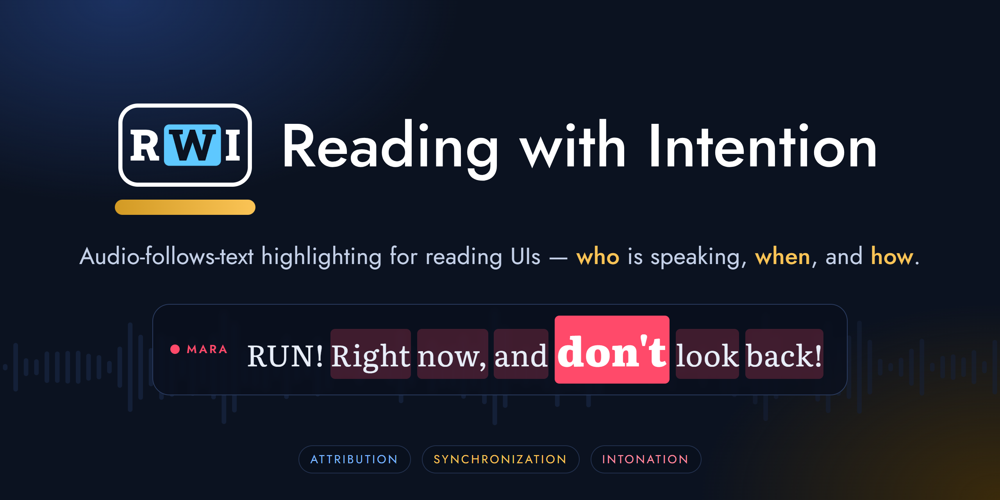
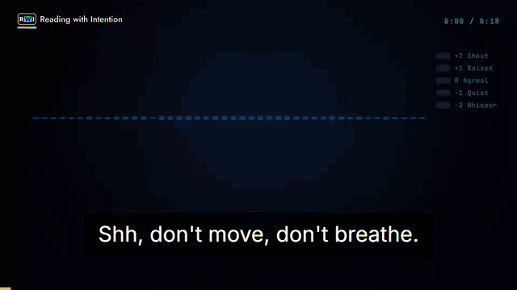
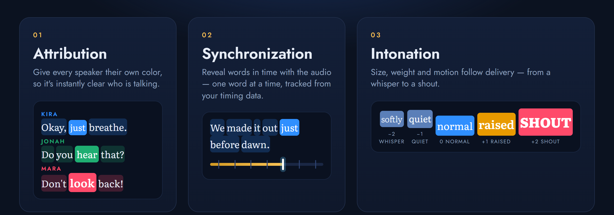
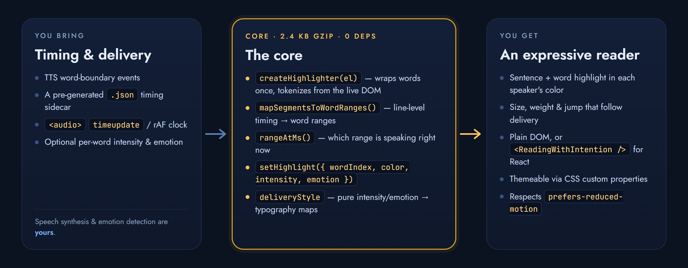

<div align="center">

[](.github/assets/banner.png)

[](LICENSE)
[](src)
[](package.json)
[](#-why-its-small)
[](#react)

[](https://github.com/L0stFromSleep/Reading-With-Intention/stargazers)
[](https://github.com/L0stFromSleep/Reading-With-Intention/issues)
[](https://github.com/L0stFromSleep/Reading-With-Intention/commits)
[](#-contributing)

**Word-by-word, audio-follows-text highlighting for reading UIs.**<br/>
Show *who* is speaking, *which word* is being read right now, and *how* it's being said —<br/>
in a tiny, framework-neutral library with an optional React binding.

[**Demo**](#-demo) · [**Install**](#-install) · [**Quick start**](#-quick-start) · [**How it works**](#-how-it-works) · [**API**](#-api-reference) · [**Recipes**](#-recipes) · [**FAQ**](#-faq)

</div>

---

## 🎬 Demo

<div align="center">



<sub>Recorded from the real library running in a browser. Three speakers · sentence + word highlight in time · a shouted word grows, bolds and jumps.</sub>

</div>

<br/>

## ✨ Why

Plain text can't tell you who's talking, where the audio is, or whether someone whispered or screamed. Karaoke-style highlighting solves the *where*. **Reading with Intention** solves all three — it's a small engine that turns *your* timing data into highlighted, expressive text.

It's inspired by [Caption with Intention](https://www.captionwithintention.org/), the Academy Award (Sci-Tech) recognized captioning system built for deaf and hard-of-hearing audiences, which rests on three ideas. This package brings the same three to reading UIs in general — audiobook players, read-aloud features, karaoke-style transcripts, language-learning apps, anywhere you need to show which word is being read.

[](.github/assets/pillars.png)

| Pillar | What it does | How you drive it |
| :-- | :-- | :-- |
| 🎨 **Attribution** | Color-codes each speaker — the sentence gets a soft tint, the current word a solid fill | `color` on `setHighlight()` |
| ⏱️ **Synchronization** | Moves the highlight word by word in time with the audio | `wordIndex` on `setHighlight()` |
| 📣 **Intonation** | Varies size, weight and motion with delivery, from whisper to shout | `intensity` (−2…2) and `emotion` |

## 🚀 Features

- **Tiny.** ~2.4 kB gzipped JS + ~1.3 kB CSS. Zero runtime dependencies.
- **Framework-neutral.** The core is plain DOM. Use it with vanilla JS, Svelte, Vue, Solid, Lit — anything.
- **Optional React binding.** `<ReadingWithIntention />` at `reading-with-intention/react`.
- **Zero-bundler build.** One `<script>` tag and one stylesheet; exposes `window.ReadingWithIntention`.
- **Cheap at any length.** Words are wrapped once; each `setHighlight()` only touches the previously and newly active sentence and word — no re-render, even for a whole chapter.
- **Always consistent with the screen.** Word and sentence tokens are read straight from the live DOM it wraps, so they can't drift from what's rendered. Links, `<em>`, images and other markup inside your paragraphs are preserved.
- **Bring your own timing.** TTS word-boundary events, a `.json` timing sidecar, an `<audio>` clock — or line-level timing that the library maps to words for you.
- **Themeable.** Every color is a CSS custom property; or copy `src/style.css` and own it.
- **Accessible by default.** Motion is skipped entirely under `prefers-reduced-motion`.
- **Typed.** Ships `.d.ts` for both entry points.

> [!NOTE]
> It does **not** do speech synthesis, timing generation or emotion detection. You bring the timing (and, optionally, per-word intensity/emotion); this library turns it into highlighted, expressive text.

## 📦 Install

> [!IMPORTANT]
> **Status:** `0.1.0`, **not yet published to npm.** Until it is, build from source (below). The `npm install` and CDN snippets are what will work once it's published.

```bash
npm install reading-with-intention
```

```js
import { createHighlighter } from "reading-with-intention";
import "reading-with-intention/style.css";
```

**Build from source today:**

```bash
git clone https://github.com/L0stFromSleep/Reading-With-Intention.git
cd Reading-With-Intention
npm install
npm run build        # -> dist/
```

<details>
<summary><b>What's in <code>dist/</code></b></summary>

| File | For |
| :-- | :-- |
| `index.js` / `index.cjs` (+ `.d.ts`) | Bundlers and Node — the framework-neutral core |
| `react.js` / `react.cjs` (+ `.d.ts`) | The optional React component (`reading-with-intention/react`) |
| `index.global.js` | Minified IIFE for a plain `<script>` tag; exposes `window.ReadingWithIntention` |
| `style.css` | The default stylesheet (`reading-with-intention/style.css`) |

</details>

## ⚡ Quick start

### Zero bundler

No build step, no framework — a `<script>` tag and the stylesheet. Full runnable version: [`examples/vanilla/index.html`](examples/vanilla/index.html).

```html
<link rel="stylesheet" href="https://unpkg.com/reading-with-intention/dist/style.css" />
<script src="https://unpkg.com/reading-with-intention/dist/index.global.js"></script>

<div id="reader" class="rwi">
  <p>Okay, just breathe. We're almost out.</p>
</div>

<script>
  const { createHighlighter } = ReadingWithIntention;
  const highlighter = createHighlighter(document.getElementById("reader"));
  highlighter.setHighlight({ wordIndex: 2, color: "#5ec8ff", intensity: -1, jump: true });
</script>
```

### Vanilla (with a bundler)

```js
import { createHighlighter } from "reading-with-intention";
import "reading-with-intention/style.css";

const container = document.querySelector("#reader");
container.classList.add("rwi"); // scopes the default stylesheet

// Word-wraps every <p> inside `container` once, and returns tokens
// (word/sentence boundaries) computed from what's actually rendered there.
const highlighter = createHighlighter(container);

// However you're tracking playback (an <audio> timeupdate, a TTS
// onboundary event, …), call setHighlight with the word to light up:
highlighter.setHighlight({
  wordIndex: 12,
  color: "#5ec8ff",  // this speaker's color
  intensity: 2,      // -2 (whisper) .. 2 (shout)
  emotion: "afraid", // "neutral" | "angry" | "sad" | "afraid" | "happy" | "surprised"
  jump: true,        // let the word jump/dip as it's spoken
  overlap: false,    // grow via font-size (push neighbors) instead of transform (can overlap)
});

// Clear when playback stops:
highlighter.setHighlight(null);
```

### React

```tsx
import { useState } from "react";
import { ReadingWithIntention, type HighlightState } from "reading-with-intention/react";
import "reading-with-intention/style.css";

function Reader({ html }: { html: string }) {
  const [highlight, setHighlight] = useState<HighlightState>(null);
  // ...drive setHighlight from your own audio/TTS playback loop...
  return <ReadingWithIntention className="rwi" html={html} highlight={highlight} />;
}
```

Word-wrapping happens once per `html` change; highlighting is applied imperatively as `highlight` changes, so a fast playback loop doesn't re-render your tree. `react >= 17` is an optional peer dependency.

## 🧠 How it works

[](.github/assets/architecture.png)

1. **`createHighlighter(container)`** wraps every word in each `<p>` in a `<span class="rwi-w">` — once — and reads word + sentence tokens out of that same DOM.
2. **You** decide which word is current, from whatever timing you have.
3. **`setHighlight(state)`** tints the current *sentence* in the speaker's color, fills the current *word* solidly, and applies size / weight / jump for the delivery. Emphasis lives on that one word only, so it settles back the instant the highlight moves on.

### 🪶 Why it's small

There's no framework, no state library and no tokenizer dependency. The whole engine is one DOM pass at mount time plus a handful of class/style writes per word — which is also why it stays fast on long documents.

## 🎚️ Delivery, at a glance

`intensity` is a five-step volume scale. Each step maps to size, weight and a one-shot vertical jump on the highlighted word:

| `intensity` | Label | Font-size × | Weight | Jump |
| :-: | :-- | :-: | :-: | :-: |
| `-2` | Whisper | 0.82 | 300 | ↓ 5 px |
| `-1` | Quiet | 0.90 | 400 | ↓ 2 px |
| `0` | Normal | 1.00 | 400 | — |
| `1` | Raised | 1.15 | 600 | ↑ 5 px |
| `2` | Shout | 1.35 | 800 | ↑ 11 px |

`emotion` adds subtle typographic accents to the current sentence:

| `emotion` | Effect (default stylesheet) |
| :-- | :-- |
| `neutral` | none |
| `angry` | `letter-spacing: 0.01em` |
| `sad` | italic, `opacity: 0.92` |
| `afraid` | `letter-spacing: 0.015em` |
| `surprised` | `font-weight: 600` |
| `happy` | adds the `rwi-emotion-happy` class, but the default stylesheet doesn't style it — hook it yourself |

> [!TIP]
> The real Caption with Intention ties weight to *pitch* and size to *volume*. This library models a single volume-like `intensity` axis and gives every level its own weight, so a whisper reads visibly lighter and a shout visibly heavier. If you have pitch data, you can drive `--rwi-weight` yourself.

## 📚 API reference

### `createHighlighter(container: HTMLElement): Highlighter`

Word-wraps every `<p>` inside `container` in a `<span class="rwi-w">` — preserving every other tag (links, `<em>`, images, …) — and computes `tokens` (word + sentence boundaries, with char offsets into a synthesized `plainText`) directly from what's rendered.

| Member | Description |
| :-- | :-- |
| `.tokens: TokenizedText` | Read-only. Use with `mapSegmentsToWordRanges` / `wordIndexAtChar`. |
| `.setHighlight(state)` | Move the highlight, or clear it with `null`. |
| `.destroy()` | Clears any active highlight. Call before you replace/unmount the container's own content. The per-word wrapping is left in place. |

### `HighlightState`

```ts
type HighlightState = {
  wordIndex: number;
  color?: string;        // any CSS color; omitted = the stylesheet's default accent
  intensity?: Intensity; // -2..2, default 0 (normal)
  emotion?: Emotion;     // default "neutral"
  overlap?: boolean;     // grow via transform (can overlap a neighbor) instead of font-size (reflows)
  jump?: boolean;        // one-shot vertical jump/dip as the word is highlighted
  letterJump?: boolean;  // (requires jump) animate each character in a stagger instead of the whole word
} | null;
```

### Timing helpers

Pure, DOM-free functions — the same math `createHighlighter` uses, exposed for when you need word/sentence boundaries before anything is mounted (e.g. building TTS request chunks up front).

| Function | Purpose |
| :-- | :-- |
| `mapSegmentsToWordRanges(tokens, segments)` | Lines up line-level timing (`{ text, startMs, endMs, speakerId?, intensity?, emotion? }[]`) against a highlighter's tokens → `SpeakerRange[]`. Length-based, so segment text needn't match byte-for-byte. |
| `rangeAtMs(ranges, ms)` | The range active at a playback time (binary search on `startMs`), or `null`. |
| `wordIndexAtChar(tokens, charOffset)` | The word index containing a character offset into `plainText`. |
| `tokenizeText(paragraphs)` | Tokenize an array of plain-text paragraphs into words + sentences. |
| `textToParagraphs(text)` | Split raw text into paragraphs on blank lines. |

### Delivery mappings (`deliveryStyle`)

Pure functions turning an `Intensity` / `Emotion` into typography — useful to preview or reuse the mappings outside the highlighter: `intensityScale`, `intensityWeight`, `intensityJumpPx`, `emotionClass`, plus `INTENSITY_LABELS` / `EMOTION_LABELS` for UI such as a settings picker.

### Types

`Intensity`, `Emotion`, `HighlightState`, `Highlighter`, `TokenizedText`, `WordToken`, `SentenceToken`, `TimingSegment`, `SpeakerRange` — all exported from the package root. The React component's props are `{ html, highlight, onTokens?, className? }`; `onTokens` fires once per `html` change with that instance's tokens.

## 🎨 Styling

`reading-with-intention/style.css` ships sensible defaults, scoped under a `.rwi` class you apply to your container, and themeable through CSS custom properties:

```css
.rwi {
  --rwi-accent: 210 90% 60%; /* "H S% L%" triplet, used as hsl(var(--rwi-accent)) */
}
```

| Custom property | Set by | Purpose |
| :-- | :-- | :-- |
| `--rwi-accent` | you | Fallback highlight color when you don't pass `color` |
| `--rwi-sentence-bg` | library | Tint on the current sentence |
| `--rwi-word-bg` | library | Fill on the current word |
| `--rwi-scale` / `--rwi-word-scale` | library | Font-size / transform growth for emphasis |
| `--rwi-weight` | library | Font weight for emphasis |
| `--rwi-jump` | library | Vertical jump distance |

Classes: `rwi-sentence`, `rwi-word`, `rwi-overlap`, `rwi-jump`, `rwi-char`, `rwi-emotion-*`.

Prefer to own the CSS? It's ~77 lines, fully commented in [`src/style.css`](src/style.css) — copy and adapt it instead of importing the package's stylesheet. The reading font, size and line height are always yours.

## 🍳 Recipes

### Follow an `<audio>` element with line-level timing

Don't have per-word timing? Give the library one entry per dialogue line (or TTS utterance) and it maps them to words:

```js
import { createHighlighter, mapSegmentsToWordRanges, rangeAtMs } from "reading-with-intention";

const highlighter = createHighlighter(document.querySelector("#reader"));

const ranges = mapSegmentsToWordRanges(highlighter.tokens, [
  { text: "Okay, just breathe.", startMs: 0, endMs: 1400, speakerId: "kira", intensity: -1 },
  { text: '"RUN!" she screamed.', startMs: 1400, endMs: 2200, speakerId: "voice", intensity: 2, emotion: "afraid" },
]);
const colors = { kira: "#5ec8ff", voice: "#ff4a6a" };

audioEl.ontimeupdate = () => {
  const ms = audioEl.currentTime * 1000;
  const range = rangeAtMs(ranges, ms);
  if (!range) return;
  const fraction = (ms - range.startMs) / (range.endMs - range.startMs);
  const wordIndex = Math.min(
    range.wordStart + Math.floor(fraction * (range.wordEnd - range.wordStart)),
    range.wordEnd - 1,
  );
  highlighter.setHighlight({
    wordIndex,
    color: colors[range.speakerId],
    intensity: range.intensity,
    emotion: range.emotion,
  });
};
```

### You already have per-word timing

Skip the mapping step and call `setHighlight` directly with each word's index as it's spoken.

### Read aloud with the browser's Speech Synthesis

`SpeechSynthesisUtterance` reports a character offset as it speaks; `wordIndexAtChar` turns that into a word index. Speak `tokens.plainText` so the offsets line up:

```js
import { createHighlighter, wordIndexAtChar } from "reading-with-intention";

const highlighter = createHighlighter(document.querySelector("#reader"));
const utterance = new SpeechSynthesisUtterance(highlighter.tokens.plainText);

utterance.onboundary = (e) => {
  if (e.name !== "word") return;
  highlighter.setHighlight({ wordIndex: wordIndexAtChar(highlighter.tokens, e.charIndex), color: "#5ec8ff" });
};
utterance.onend = () => highlighter.setHighlight(null);

speechSynthesis.speak(utterance);
```

### Let one word grow over its neighbors

By default an emphasized word grows via `font-size`, which reflows the line — neighbors are pushed apart, never covered. For a more dramatic single word, opt into `overlap` (transform-based, no reflow) and, if you like, `letterJump` for a per-character stagger:

```js
highlighter.setHighlight({ wordIndex: 7, intensity: 2, jump: true, overlap: true, letterJump: true });
```

## ♿ Accessibility

The jump/dip animation is wrapped in `@media (prefers-reduced-motion: no-preference)` and is skipped entirely for anyone whose OS requests reduced motion — appropriate for a feature descended from an accessibility technology in the first place. Delivery is carried by size, weight and motion, not by color alone.

## ❓ FAQ

<details>
<summary><b>Does it generate speech or timing?</b></summary>

No. It renders. You supply the current word (and optionally its speaker color, intensity and emotion) from your TTS API, a timing sidecar, or an audio clock.
</details>

<details>
<summary><b>What text does it highlight?</b></summary>

Every `<p>` inside the container you pass to `createHighlighter`. Other markup inside those paragraphs (links, `<em>`, images) is preserved; only text nodes are split into word spans. Content outside `<p>` elements — like speaker labels in the demo — is left alone.
</details>

<details>
<summary><b>How do I know which <code>wordIndex</code> to use?</b></summary>

Index into <code>highlighter.tokens.words</code>. Get it from a character offset with <code>wordIndexAtChar</code>, from line-level timing with <code>mapSegmentsToWordRanges</code>, or count words yourself if you already have per-word timing.
</details>

<details>
<summary><b>Can I swap the paragraph content after mounting?</b></summary>

Call <code>highlighter.destroy()</code>, replace the content, then create a new highlighter. In React, the component re-runs the wrapping automatically whenever <code>html</code> changes.
</details>

<details>
<summary><b>Is it a drop-in for the official Caption with Intention?</b></summary>

No — see <a href="#-relationship-to-caption-with-intention">below</a>. It's an independent reinterpretation of the same public design principles for reading UIs, not a redistribution of the official fonts, templates or design system.
</details>

## 🛠️ Development

```bash
npm install
npm run build       # tsup -> dist/{index,react}.{js,cjs,d.ts} + dist/index.global.js (minified IIFE)
npm run typecheck
npm run clean
```

```
.
├── src/
│   ├── highlighter.ts     # DOM engine: createHighlighter / setHighlight
│   ├── textHighlight.ts   # pure tokenization + timing math
│   ├── deliveryStyle.ts   # intensity / emotion -> typography maps
│   ├── react.tsx          # optional React binding
│   ├── types.ts
│   ├── style.css          # default, themeable stylesheet
│   └── index.ts           # public entry
├── examples/vanilla/      # zero-bundler demo
└── .github/assets/        # logo, banner, demo GIF, diagrams
```

## 🤝 Contributing

Issues and pull requests are welcome. For anything non-trivial, open an issue first so we can agree on the approach. Please run `npm run typecheck` and `npm run build` before sending a PR, and keep the core dependency-free.

## 🎨 Brand assets

The logo is an independent design: a caption-box frame, slab initials with the "current word" highlighted, and a gold progress bar. Files live in [`.github/assets/`](.github/assets):

<table>
  <tr>
    <td align="center">
      <picture>
        <source media="(prefers-color-scheme: dark)" srcset=".github/assets/logo-dark.svg">
        <source media="(prefers-color-scheme: light)" srcset=".github/assets/logo-light.svg">
        
      </picture>
    </td>
    <td align="center">
      <picture>
        <source media="(prefers-color-scheme: dark)" srcset=".github/assets/logo-mark-dark.svg">
        <source media="(prefers-color-scheme: light)" srcset=".github/assets/logo-mark-light.svg">
        
      </picture>
    </td>
  </tr>
  <tr>
    <td align="center"><sub><code>logo-{dark,light}.svg</code></sub></td>
    <td align="center"><sub><code>logo-mark-{dark,light}.svg</code></sub></td>
  </tr>
</table>

## 🙏 Relationship to Caption with Intention

This is an independent, open-source reinterpretation of [Caption with Intention](https://www.captionwithintention.org/)'s public design principles — color attribution, synchronized reveal, and variable typography for volume and pitch — for reading UIs. It is **not** affiliated with, endorsed by, or a redistribution of the official Caption with Intention design system, fonts, or After Effects templates. Its name and marks belong to their owners; this project's logo borrows only the general idea of a captioned-frame lockup and is not a copy. See [captionwithintention.org](https://www.captionwithintention.org/) for the original.

## 📄 License

[MIT](LICENSE) © Reading with Intention contributors

<div align="center">
<br/>
<sub>If this is useful to you, a ⭐ helps others find it.</sub>
</div>
